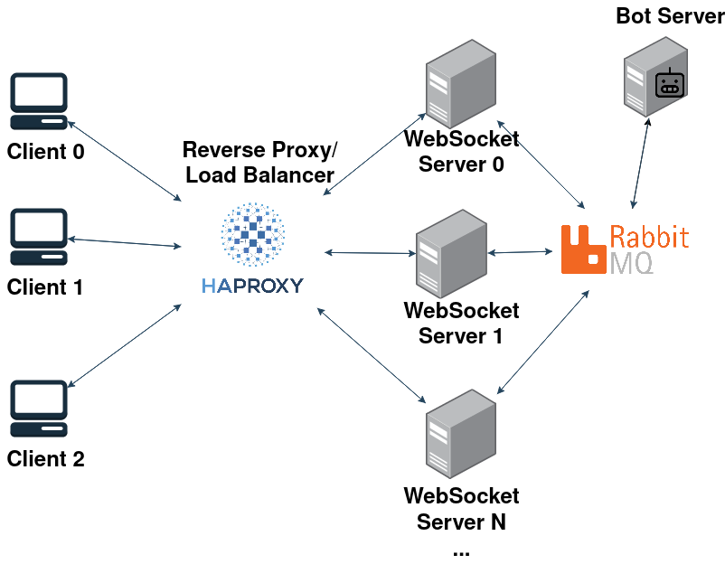

# investor-chat
investor-chat is a real-time chat application that runs in the browser

## Preview
https://github.com/ap-pauloafonso/investor-chat/assets/26802978/f3de8351-894e-42c3-9a7f-e1e43dfd3d19

## Features
* Login/Register user
* Real time chat
* Multiple Channels(chatrooms)
* Messages are archived in the database 
* Chat-bot to get the current stock price: `/stock=[STOCK_CODE]` - example `/stock=aapl.us`

## Architecture 

* The Backend was built using Go, and is architected for high performance and scalability, The main idea is to use Restful APIS for login/signup/create-or-get-channels and Websockets for real time messaging
* The architecture supports horizontal scalability with a reverse-proxy/load balancer (HAProxy) to distribute requests evenly across WebSocket servers. This can be expanded by spinning up additional WebSocketServer instances if needed
  * This is achieved through the implementation of a 'sticky session' concept, where the balancer assigns a unique session cookie to the client. This cookie ensures that the user remains connected to a specific server until the session is terminated

 ### Backend key components
* **Database**: Using PostgreSQL for storage.
* **WebsocketServer**: Blends WebSockets for instant messaging with RESTful APIs for login, signup, and channel management. This dual approach ensures quicker chat interactions with ongoing client connections, while following to standard REST protocols for other tasks
* **BotServer**: Listens to messages requesting stock information, processes them, and places them back in the queue for WebSocketServers to consume and broadcast to all connections
* **ArchiverServer**: Designed to ensure data history persistence by deploying a consumer to continuously listen for incoming messages and write them to the database. Additionally, it serves a gRPC server that allows clients to retrieve the history of messages stored in the database
  * While non-relational databases like Cassandra could be used for faster read/write operations, **PostgreSQL** was chosen for simplicity as the other parts of the system also uses it
* **Pub/Sub Mechanism**: Employing RabbitMQ for efficient communication between WebSocketServers, BotServer and the ArchiverServer

### Frontend (clients)
* Built with React and TailwindCSS and embedded into the go binary 

## Running it with Docker and Testing
* Make sure that you don't have any other docker containers running
* Run `docker-compose up --build`
* Go to http://localhost
* For testing with a second account, open an anonymous tab or another browser, as sessions are managed through cookies

